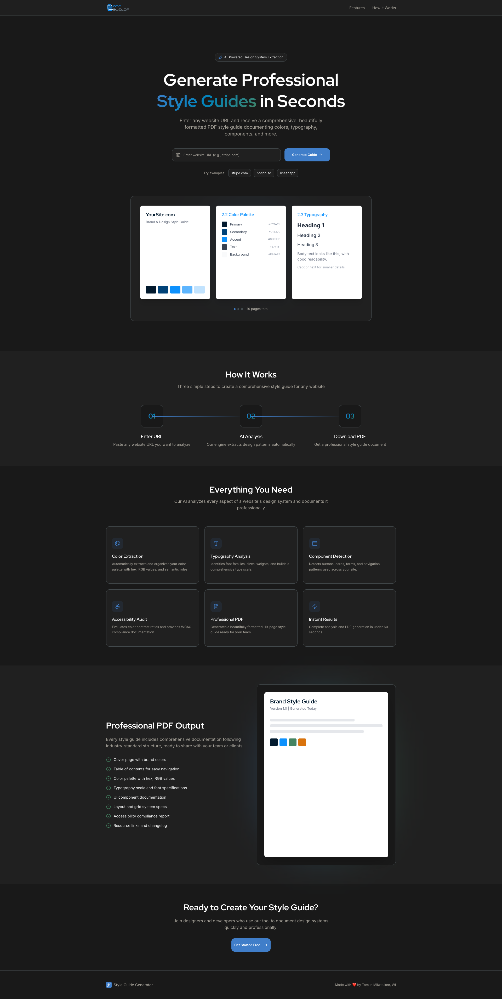
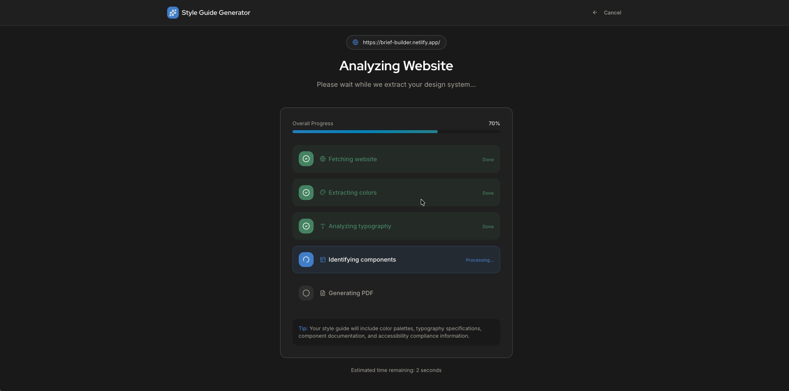
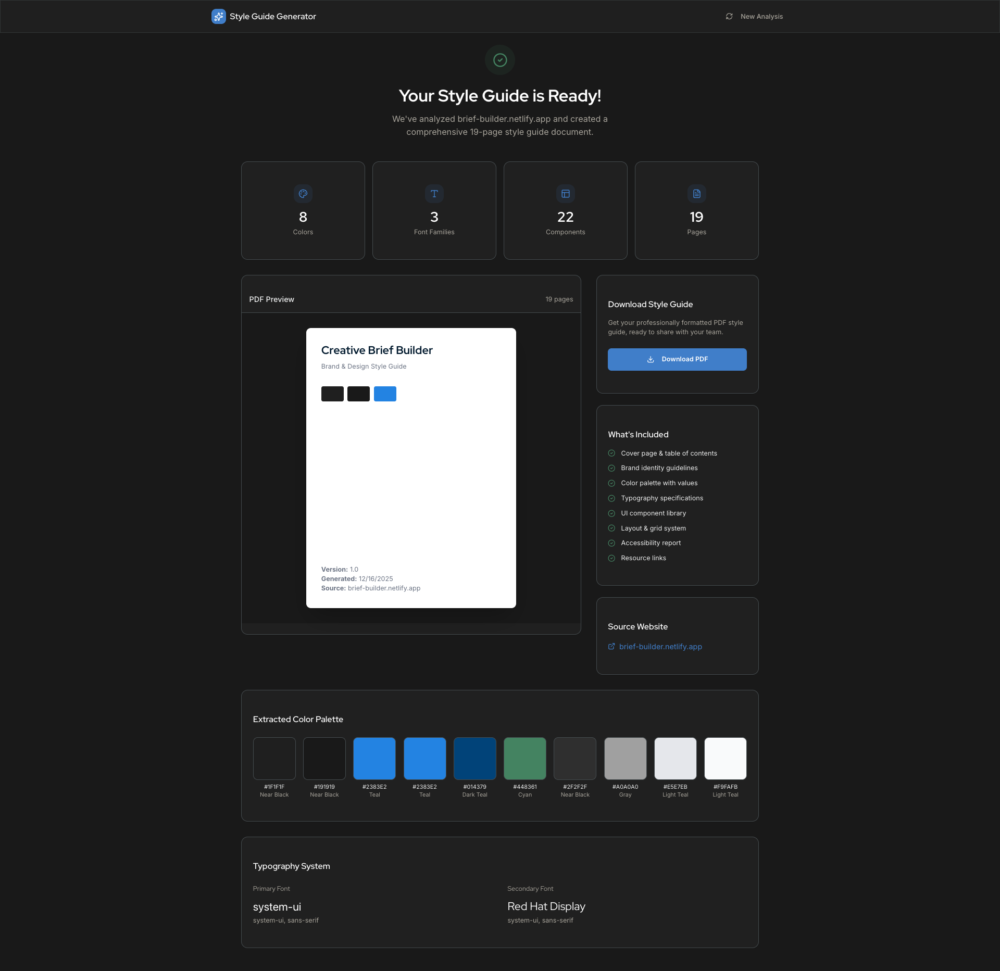

# PRD Builder

An AI-powered web application that generates professional Product Requirements Documents (PRDs) from simple product descriptions and uploaded files.



## Features

- **AI-Powered Generation**: Uses Claude Sonnet 4.5 to create comprehensive PRDs
- **File Upload Support**: Accept PDF, DOCX, and image files for additional context
- **Real-Time Streaming**: Watch your PRD generate in real-time with progress tracking
- **Professional PDF Export**: Download beautifully formatted PRDs with custom styling
- **Dark-Themed UI**: Modern interface with a custom blue color palette
- **No Authentication Required**: Fully public, stateless tool for quick PRD generation



## Tech Stack

- **Framework**: [Next.js 15](https://nextjs.org/) with App Router and TypeScript
- **Styling**: [Tailwind CSS](https://tailwindcss.com/) with custom design system
- **AI Provider**: [Anthropic Claude API](https://www.anthropic.com/) (Haiku 4.5)
- **PDF Generation**: [@react-pdf/renderer](https://react-pdf.org/)
- **File Processing**:
  - PDF: `pdf-parse`
  - DOCX: `mammoth`
  - Images: Base64 encoding
- **Markdown Rendering**: `react-markdown`
- **Icons**: [Lucide React](https://lucide.dev/)
- **Hosting**: [Netlify](https://www.netlify.com/) with serverless functions

## Getting Started

### Prerequisites

- Node.js 20.x or higher
- npm or yarn
- Anthropic API key ([Get one here](https://console.anthropic.com/))

### Installation

1. Clone the repository:
```bash
git clone https://github.com/yourusername/prd-builder.git
cd prd-builder
```

2. Install dependencies:
```bash
npm install
```

3. Set up environment variables:
```bash
cp .env.local.example .env.local
```

Then edit `.env.local` and add your Anthropic API key:
```
ANTHROPIC_API_KEY=your_anthropic_api_key_here
```

4. Run the development server:
```bash
npm run dev
```

5. Open [http://localhost:3000](http://localhost:3000) in your browser.

## Project Structure

```
prd-builder/
├── app/
│   ├── layout.tsx              # Root layout with dark theme
│   ├── page.tsx                # Main application with state management
│   ├── globals.css             # Tailwind styles and custom CSS
│   └── api/
│       └── generate/
│           └── route.ts        # Anthropic API streaming endpoint
├── components/
│   ├── Header.tsx              # Navigation header
│   ├── landing/                # Landing page sections
│   ├── progress/               # Generation progress screen
│   └── output/                 # PRD output and download screen
├── lib/
│   ├── utils.ts                # Utility functions
│   ├── prdTemplate.ts          # PRD structure and sections
│   ├── promptBuilder.ts        # Claude prompt construction
│   ├── pdfGenerator.tsx        # PDF generation logic
│   └── fileProcessors/         # File upload processors
│       ├── pdfProcessor.ts
│       ├── docxProcessor.ts
│       └── imageProcessor.ts
├── types/
│   └── index.ts                # TypeScript type definitions
└── public/                     # Static assets
```

## Usage

1. **Enter Product Details**: Provide a product name and description
2. **Upload Files (Optional)**: Add PDF, DOCX, or image files for additional context
3. **Generate**: Click "Generate PRD" and watch it create your document in real-time
4. **Download**: Export as PDF or Markdown when complete



## PRD Structure

Generated PRDs include the following sections:

1. Executive Summary
2. Product Overview
3. Objectives and Goals
4. Target Audience
5. Scope (In/Out/Future)
6. Functional Requirements
7. Non-Functional Requirements
8. User Interface Requirements
9. Technical Requirements
10. Success Metrics
11. Timeline and Milestones
12. Risks and Mitigation
13. Dependencies and Assumptions
14. Future Enhancements
15. Appendix

## Development Commands

```bash
# Start development server
npm run dev

# Build for production
npm run build

# Start production server
npm start

# Lint code
npm run lint
```

## Deployment

### Deploy to Netlify

1. Connect your GitHub repository to Netlify
2. Configure build settings:
   - **Build command**: `npm run build`
   - **Publish directory**: `.next`
3. Add environment variable in Netlify dashboard:
   - `ANTHROPIC_API_KEY`: Your Anthropic API key
4. Deploy!

The project includes a `netlify.toml` configuration file with optimized settings for Next.js.

### Other Platforms

This is a standard Next.js application and can be deployed to:
- [Vercel](https://vercel.com/) (recommended for Next.js)
- [AWS Amplify](https://aws.amazon.com/amplify/)
- [Railway](https://railway.app/)
- Any platform supporting Next.js applications

## Design System

The application uses a custom blue-themed color palette:

```typescript
colors: {
  background: "#191919",         // Dark background
  "prussian-blue": "#021A2E",   // Deepest blue
  "yale-blue": "#014379",       // Medium blue
  "dodger-blue": "#0d91fd",     // Primary accent
  "cool-sky": "#5db5fe",        // Light accent
  "icy-blue": "#c2e3fe",        // Lightest blue
}
```

## API Reference

### POST /api/generate

Generates a PRD document using Claude AI with streaming response.

**Request Format**: `multipart/form-data`

**Parameters**:
- `productName` (required): Name of the product
- `description` (required): Product description
- `goals` (optional): Product goals
- `targetAudience` (optional): Target audience
- `features` (optional): JSON array of features
- `files` (optional): Multiple file uploads (PDF, DOCX, images)

**Response Format**: Server-Sent Events (SSE)

```
data: {"text": "chunk of content"}
data: {"text": "more content"}
data: [DONE]
```

## Configuration

### Environment Variables

| Variable | Description | Required |
|----------|-------------|----------|
| `ANTHROPIC_API_KEY` | Your Anthropic API key | Yes |

### Timeout Settings

- **Generation Timeout**: 3 minutes (180 seconds)
- **Netlify Function Timeout**: 5 minutes (300 seconds, configurable in route.ts)

## Known Limitations

- Maximum file size depends on the Claude API context window
- Netlify free tier has function execution time limits
- PDF generation is client-side only (requires browser environment)
- Large documents may take 1-2 minutes to generate

## Contributing

Contributions are welcome! Please feel free to submit a Pull Request.

1. Fork the repository
2. Create your feature branch (`git checkout -b feature/AmazingFeature`)
3. Commit your changes (`git commit -m 'Add some AmazingFeature'`)
4. Push to the branch (`git push origin feature/AmazingFeature`)
5. Open a Pull Request

## License

This project is open source and available under the [MIT License](LICENSE).

## Acknowledgments

- Built with [Next.js](https://nextjs.org/)
- Powered by [Anthropic Claude](https://www.anthropic.com/)
- PDF generation by [@react-pdf/renderer](https://react-pdf.org/)
- Icons by [Lucide](https://lucide.dev/)

## Support

For issues, questions, or suggestions, please [open an issue](https://github.com/yourusername/prd-builder/issues) on GitHub.

---

Made with ❤️ by the PRD Builder team
